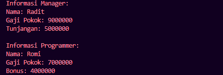

# Tugas Praktikum 4 (Pertemuan ke 5) 

|Nama|NIM|Kelas|Mata Kuliah|
|----|---|-----|------|
|**Romi Rahman**|**312310581**|**TI.23.A6**|**Pemrograman Orientasi Objek**|


# • Lengkapi latihan class Mahasiswa dengan setter dan getter.

## • Mahasiswa.java
```java
public class Mahasiswa extends Manusia {
    String nim;
    String jurusan;

    public Mahasiswa(String nama, String jenisKelamin, int umur, String alamat, String nim, String jurusan) {
        super(nama, jenisKelamin, umur, alamat);
        this.nim = nim;
        this.jurusan = jurusan;
    }

    public String getNim() {
        return nim;
    }

    public void setNim(String nim) {
        this.nim = nim;
    }

    public String getJurusan() {
        return jurusan;
    }

    public void setJurusan(String jurusan) {
        this.jurusan = jurusan;
    }
}
```

## • Manusia.java
```java
public class Manusia {
    String nama;
    String jenisKelamin;
    int umur;
    String alamat;

    public Manusia(String nama, String jenisKelamin, int umur, String alamat) {
        this.nama = nama;
        this.jenisKelamin = jenisKelamin;
        this.umur = umur;
        this.alamat = alamat;
    }

    public String getNama() {
        return nama;
    }

    public void setNama(String nama) {
        this.nama = nama;
    }

    public String getJenisKelamin() {
        return jenisKelamin;
    }

    public void setJenisKelamin(String jenisKelamin) {
        this.jenisKelamin = jenisKelamin;
    }

    public int getUmur() {
        return umur;
    }

    public void setUmur(int umur) {
        this.umur = umur;
    }

    public String getAlamat() {
        return alamat;
    }

    public void setAlamat(String alamat) {
        this.alamat = alamat;
    }

    public void cetakInfo() {
        System.out.println("Nama            : " + this.nama);
        System.out.println("Jenis Kelamin   : " + this.jenisKelamin);
        System.out.println("Umur            : " + this.umur);
        System.out.println("Alamat          : " + this.alamat);
    }
}
```

## • MahasiswaBeraksi.java
```java
public class MahasiswaBeraksi {
    public static void main(String[] args) {
        Mahasiswa romi = new Mahasiswa("Romi Rahman", "Laki-Laki", 20, "Tambun", "312310581", "Teknik Informatika");

        romi.cetakInfo();
        System.out.println("NIM             : " + romi.getNim());
        System.out.println("Jurusan         : " + romi.getJurusan());
    }
}
```

# Output
.png)

# • Implementasikan java code diagram class berikut :

## • Pegawai.java
```java
import java.text.DecimalFormat;

class Pegawai {
    private String nama;
    private double gajiPokok;

    public void setNama(String nama) {
        this.nama = nama;
    }

    public String getNama() {
        return nama;
    }

    public void setGajiPokok(double gajiPokok) {
        this.gajiPokok = gajiPokok;
    }

    public double getGajiPokok() {
        return gajiPokok;
    }

    public void cetakInfo() {
        DecimalFormat df = new DecimalFormat("#.##");  
        System.out.println("Nama: " + nama);
        System.out.println("Gaji Pokok: " + df.format(gajiPokok));
    }
}
```
### Penjelasan :
```
• Atribut:
- nama: menyimpan nama pegawai.
- gajiPokok: menyimpan gaji pokok pegawai.

• Method:
- setNama(): untuk menetapkan (set) nama pegawai.
- getNama(): untuk mengambil (get) nama pegawai.
- setGajiPokok(): untuk menetapkan gaji pokok pegawai.
- getGajiPokok(): untuk mengambil gaji pokok pegawai.
- cetakInfo(): menampilkan informasi pegawai dengan format 2 angka di belakang koma untuk gaji pokok.
```

## • Manager.java
```java
class Manager extends Pegawai {
    private double tunjangan;

    public void setTunjangan(double tunjangan) {
        this.tunjangan = tunjangan;
    }

    public double getTunjangan() {
        return tunjangan;
    }

    @Override
    public void cetakInfo() {
        DecimalFormat df = new DecimalFormat("#.##"); 
        super.cetakInfo(); 
        System.out.println("Tunjangan: " + df.format(tunjangan));
    }
}
```
### Penjelasan :
```
Penjelasan:
• Atribut:
- tunjangan: menyimpan tunjangan untuk manajer.

• Method:
- setTunjangan(): untuk menetapkan tunjangan manajer.
- getTunjangan(): untuk mengambil tunjangan manajer.
- cetakInfo(): menampilkan informasi dari kelas Pegawai (menggunakan super.cetakInfo()) dan menambahkan informasi tentang tunjangan.
- super.cetakInfo() memanggil method cetakInfo() dari kelas Pegawai.
```

## • Programmer.java
```java
class Programmer extends Pegawai {
    private double bonus;

    public void setBonus(double bonus) {
        this.bonus = bonus;
    }

    public double getBonus() {
        return bonus;
    }

    @Override
    public void cetakInfo() {
        DecimalFormat df = new DecimalFormat("#.##"); 
        super.cetakInfo(); 
        System.out.println("Bonus: " + df.format(bonus));
    }
}
```
### Penjelasan:
```
• Atribut:
- bonus: menyimpan bonus untuk programmer.
  
• Method:
- setBonus(): untuk menetapkan bonus programmer.
- getBonus(): untuk mengambil bonus programmer.
- cetakInfo(): menampilkan informasi dari kelas Pegawai dan menambahkan informasi tentang bonus.
```

## • Main.java
```java
public class Main {
    public static void main(String[] args) {
        Manager manager = new Manager();
        manager.setNama("Radit");
        manager.setGajiPokok(9000000);
        manager.setTunjangan(5000000);

        System.out.println("Informasi Manager:");
        manager.cetakInfo(); 

        System.out.println();

        Programmer programmer = new Programmer();
        programmer.setNama("Romi");
        programmer.setGajiPokok(7000000);
        programmer.setBonus(4000000);

        System.out.println("Informasi Programmer:");
        programmer.cetakInfo();
    }
}
```
### Penjelasan :
```
• Objek Manager:
- Kita membuat objek Manager bernama manager.
- Kemudian kita menetapkan nilai nama, gajiPokok, dan tunjangan.
- Terakhir, kita mencetak informasi manager dengan cetakInfo().

• Objek Programmer:
- Kita membuat objek Programmer bernama programmer.
- Kemudian kita menetapkan nilai nama, gajiPokok, dan bonus.
- Terakhir, kita mencetak informasi programmer dengan cetakInfo().
```

# Output

